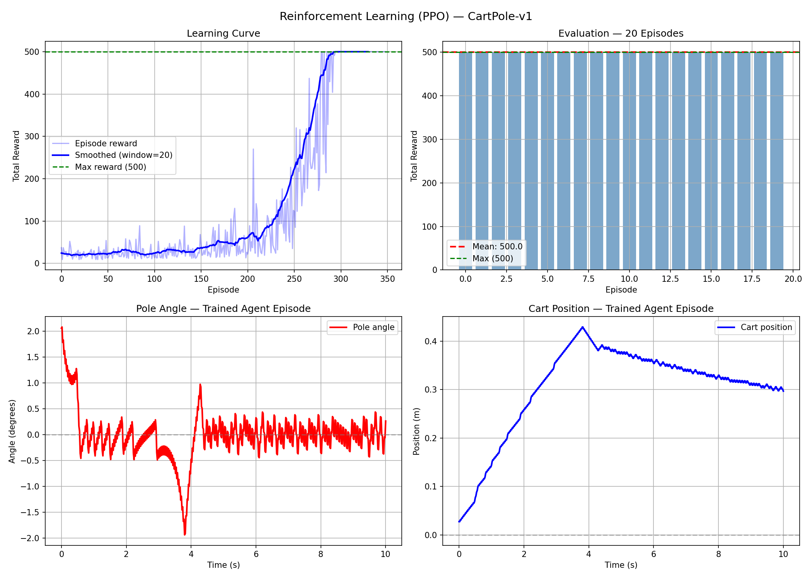

# Reinforcement Learning (PPO) , CartPole Stabilization

## Overview
Training a Proximal Policy Optimization (PPO) agent to stabilize an inverted pendulum (CartPole-v1) using reinforcement learning. The agent learns purely from interaction with the environment , no explicit dynamic model, no physics equations.

This project is the companion to LIP-MPC-Biped, where the same inverted pendulum problem is solved using Model Predictive Control. The comparison highlights the fundamental difference between model-based and model free control approaches , a central debate in modern robotics and exoskeleton control.

## Problem
Same as MPC-CartPole: keep the pole balanced upright by applying horizontal forces to the cart.

State: [x, x_dot, θ, θ_dot]
Action: discrete force left or right
Reward: +1 for every timestep the pole stays upright
Max reward per episode: 500

## Approach

### Algorithm , PPO (Proximal Policy Optimization)
PPO is a policy gradient method that learns a neural network policy
mapping states to actions. Key hyperparameters:

- Learning rate : 3e-4
- Horizon       : 2048 steps
- Batch size    : 64
- Epochs        : 10
- Discount      : γ = 0.99
- Total steps   : 50,000

### Training loop
1. Agent interacts with environment, collecting experience
2. PPO updates policy to maximize expected reward
3. Repeat until convergence

No dynamic model is required , the agent discovers the control
strategy purely from reward signals.

## Results

- **Learning Curve** , agent converges to maximum reward (500)
  after ~300 episodes, showing clear learning progression
- **Evaluation** , 20/20 episodes at perfect score 500/500
- **Pole Angle** , rapid micro-corrections around 0°,
  characteristic of learned RL policy
- **Cart Position** , stabilizes after initial drift

## MPC vs RL , Key Differences

| | MPC | PPO (RL) |
|---|---|---|
| Model required | Yes , explicit dynamics | No , learned from scratch |
| Interpretability | High , optimization problem | Low , neural network |
| Convergence | Smooth, predictable | Oscillatory micro-corrections |
| Compute at runtime | Heavy , solves optimization | Light , forward pass only |
| Adaptability | Fixed model | Can adapt via retraining |

Both approaches successfully stabilize the system.
MPC is more interpretable and smooth.
RL is more flexible and requires no model knowledge.
Hybrid approaches (model-based RL) combine both.

## Project Structure
RL-CartPole/
├── src/
│   └── train.py         # PPO training and evaluation
├── results/
│   └── rl_result.png    # training curves and episode visualization
├── requirements.txt
└── main.py              # run training and plot results

## Setup & Run

### 1. Create virtual environment (recommended)

Linux/macOS:
python3 -m venv venv
source venv/bin/activate

Windows:
python -m venv venv
venv\Scripts\activate

### 2. Install dependencies
pip install -r requirements.txt

### 3. Run
python main.py

### Notes
- Python 3.8+ required
- No GPU required , trains on CPU in 2-3 minutes
- Tested on Linux (Ubuntu 22.04), Windows 10/11

## Relevance to Legged Robotics
RL is increasingly used in exoskeleton and bipedal robot control to
learn gaits and recovery behaviors that are difficult to model
analytically. PPO and SAC are the most widely used algorithms for
locomotion policy training.

## Author
Meriam Yanelle Ghezloun , Robotics Engineer
LinkedIn: https://www.linkedin.com/in/yanelle-ghezloun/
GitHub: https://github.com/yanelle-ghezloun/
